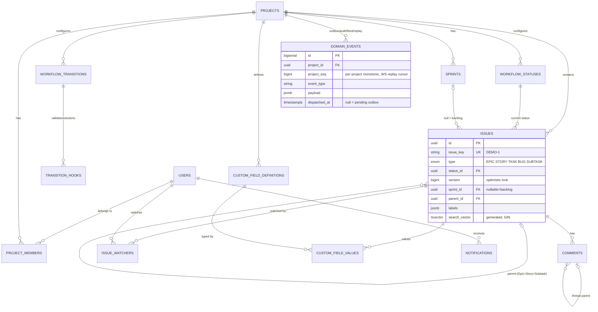

# Entity Relationship Diagram

```mermaid
erDiagram
    USERS ||--o{ PROJECT_MEMBERS : "belongs to"
    PROJECTS ||--o{ PROJECT_MEMBERS : "has"
    PROJECTS ||--o{ WORKFLOW_STATUSES : "configures"
    PROJECTS ||--o{ WORKFLOW_TRANSITIONS : "configures"
    WORKFLOW_TRANSITIONS ||--o{ TRANSITION_HOOKS : "validators/actions"
    PROJECTS ||--o{ SPRINTS : "has"
    PROJECTS ||--o{ ISSUES : "contains"
    WORKFLOW_STATUSES ||--o{ ISSUES : "current status"
    SPRINTS o|--o{ ISSUES : "null = backlog"
    ISSUES o|--o{ ISSUES : "parent (Epic>Story>Subtask)"
    ISSUES ||--o{ COMMENTS : "has"
    COMMENTS o|--o{ COMMENTS : "thread parent"
    ISSUES ||--o{ ISSUE_WATCHERS : "watched by"
    USERS ||--o{ ISSUE_WATCHERS : "watches"
    PROJECTS ||--o{ CUSTOM_FIELD_DEFINITIONS : "defines"
    ISSUES ||--o{ CUSTOM_FIELD_VALUES : "values"
    CUSTOM_FIELD_DEFINITIONS ||--o{ CUSTOM_FIELD_VALUES : "typed by"
    PROJECTS ||--o{ DOMAIN_EVENTS : "outbox/audit/feed/replay"
    USERS ||--o{ NOTIFICATIONS : "receives"

    ISSUES {
        uuid id PK
        string issue_key UK "DEMO-1"
        enum type "EPIC STORY TASK BUG SUBTASK"
        uuid status_id FK
        bigint version "optimistic lock"
        uuid sprint_id FK "nullable=backlog"
        uuid parent_id FK
        jsonb labels
        tsvector search_vector "generated, GIN"
    }
    DOMAIN_EVENTS {
        bigserial id PK
        uuid project_id FK
        bigint project_seq "per-project monotonic, WS replay cursor"
        string event_type
        jsonb payload
        timestamptz dispatched_at "null = pending outbox"
    }
```
